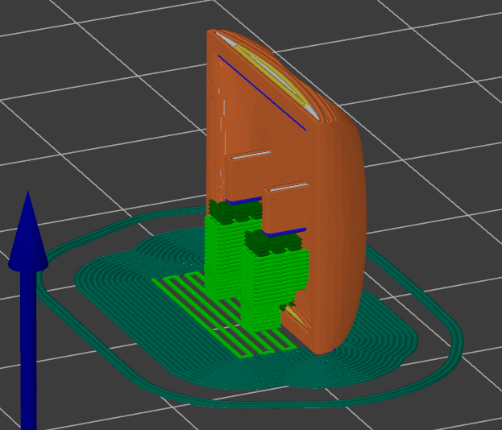
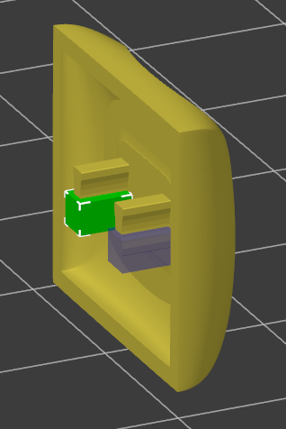
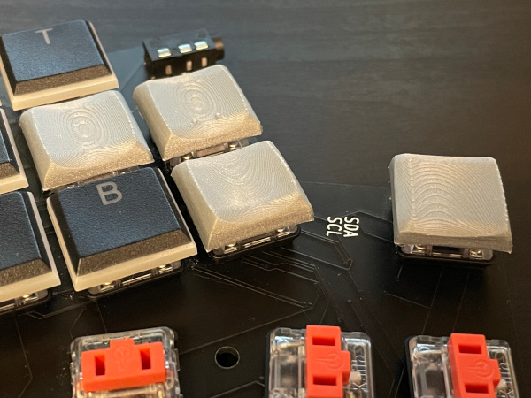

# What are these STLs?

ccs if for Choc Chicago Steno

then r3 etc means row 3 profile

then various parameters used in scad file to create STLs

Changes from previously posted versions are modification to the stem (which goes into keyswitch). When looking at keycap from top down (or bottom up) I made the portion of the stem that intersects the X-Y plane wider along the X axis (the shorter dimension of this scalloped rectangle) and the Y axis shorter. I did this because I had to shave off some plastic on all the stemsm and it was also a loose fit side to side. Your mileage may vary with printer settings etc, so do a test print! Don't print a bunch and then get fed up and reprint them like I did.

## Printing Suggestions

I prefer printing the keycaps vertically - see screengrabs from Prusa below. One showing print orientation and generated supports, and one showing the selective support enforcer cubes I added so that Prusa didn't go crazy with supports everywhere.

Why did I bother with this? Becuse if you print them such that the stems are flat against the build plate (so that the main surface of the keycap which you touch is parallel with build plate) you get layer lines on exactly that main part of the keycap you touch. They aren't horrible, and if you go thin enough you can't really feel them. It's more a confusing texture than bumpy/ridged, but I'm customizing scad files to creat custom keycaps for a custom board - of course I did one more hting to make my life harder. Printing vertically makes the keycaps much smoother at a quicker/larger layer height. The other big reason I printed them vertically is I could then use rainbow filament to print the keycaps and get a neat gradient.

